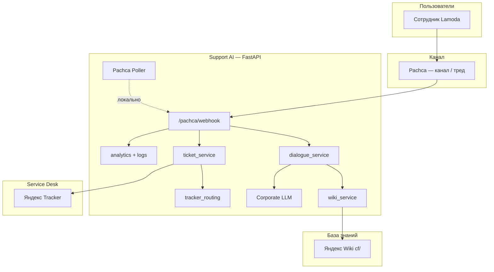
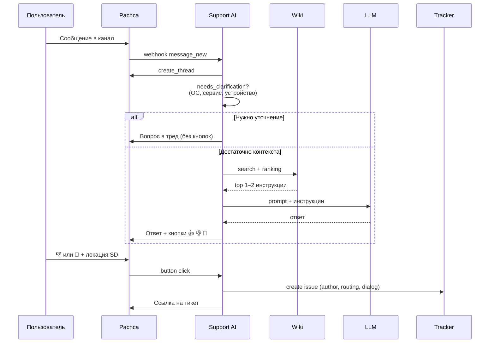
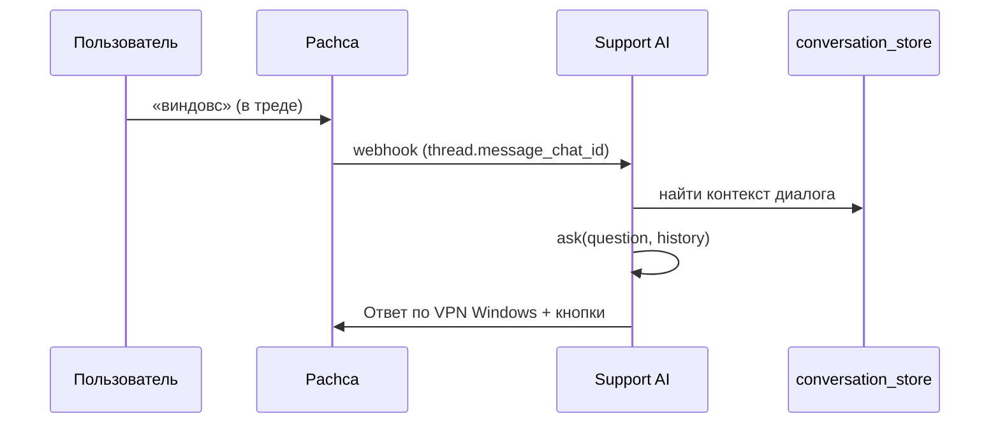

# Архитектура Support AI

## Назначение

Support AI снижает нагрузку на Service Desk за счёт **самообслуживания по базе знаний** и **автоматического оформления обращений**, когда инструкции недостаточно.

Ключевой принцип: **LLM не является источником истины** — ответ строится только на найденных инструкциях Wiki + контексте диалога.

---

## Общая схема



---

## Слои решения

```text
┌─────────────────────────────────────────────────────────┐
│  Канал взаимодействия          Pachca (webhook/poller)  │
├─────────────────────────────────────────────────────────┤
│  API-слой                      app/api/                 │
├─────────────────────────────────────────────────────────┤
│  Диалог и оркестрация          dialogue_service           │
├─────────────────────────────────────────────────────────┤
│  Retrieval (поиск)             wiki_service + priorities  │
├─────────────────────────────────────────────────────────┤
│  Генерация ответа              llm (OpenAI-compatible)  │
├─────────────────────────────────────────────────────────┤
│  Маршрутизация SD              tracker_routing + matrix   │
├─────────────────────────────────────────────────────────┤
│  Тикеты                        ticket_service + tracker   │
├─────────────────────────────────────────────────────────┤
│  Наблюдаемость                 analytics, log_buffer    │
└─────────────────────────────────────────────────────────┘
```

Подробнее по модулям: [components.md](components.md).  
Визуальные схемы: [diagrams/support-ai-architecture.drawio](diagrams/support-ai-architecture.drawio) · [PNG](diagrams/support-ai-architecture.png)

---

## Поток: новое обращение



---

## Поток: уточнение в треде



Важно: для сообщений в треде контекст ищется по `thread.message_chat_id`, а не только по `chat_id` канала.

---

## Поток: маршрутизация тикета

```text
Диалог + локация SD
        │
        ├── Диагностика ИТ (Wi‑Fi, кнопки) → без systemsd, компонент «Диагностика»
        │
        ├── Keywords → Система SD (149 систем)
        │       → очередь SUPINT / TECHCX / по локации
        │       → компонент SUPINT (или «Другое»)
        │
        └── Не распознано → «Нет в списке (другой)», TECHCX

Категория обращения — по контексту диалога (resolve_category), не по жёсткой таблице.
```

Матрица: `app/knowledge/system_sd_matrix.py` (150 систем SD).

---

## Принципы архитектуры

| Принцип | Реализация |
|---------|------------|
| **Grounded answers** | LLM получает только top 1–2 страницы Wiki |
| **Минимум LLM-вызовов** | Уточнения (ОС, сервис) — rule-based, без LLM |
| **Explicit routing** | Keywords + матрица SD, не «магия LLM» |
| **Human in the loop** | 👍/👎, кнопка тикета, автор тикета = пользователь |
| **Observability** | SQLite-события, дашборд, in-memory логи |
| **Итеративная калибровка** | Keywords и категории — по реальным обращениям |

---

## Что сознательно не в scope v0.6

- Vector DB / embeddings (поиск через Wiki API + ranking)
- Autonomous agent с произвольными tool calls
- Multi-channel (только Pachca)
- Автотесты маршрутизации (калибровка в боевой среде)

---

## Связанные документы

- [components.md](components.md)
- [integrations.md](integrations.md)
- [roadmap.md](roadmap.md)
