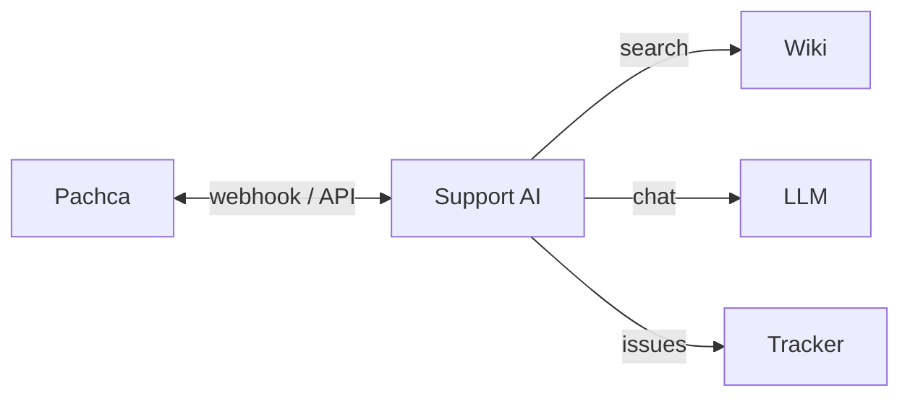

# Интеграции

Внешние системы и контракты Support AI.

---

## Сводная таблица

| Система | Роль | Протокол | Направление |
|---------|------|----------|-------------|
| **Pachca** | Канал обращений | REST + webhook | In + Out |
| **Яндекс Wiki** | База знаний | REST API | Out |
| **Corporate LLM** | Генерация ответа | OpenAI-compatible | Out |
| **Яндекс Tracker** | ITSM / тикеты SD | REST API v3 | Out |

---

## Pachca

### Входящие события

| Событие | Обработчик |
|---------|------------|
| `message_new` | Новое сообщение / follow-up в треде |
| `button` / `button_click` | 👍 👎 🎫, выбор локации |

Endpoint: `POST /pachca/webhook`

### Локальная разработка

Pachca не шлёт webhook на `localhost`:

1. **Poller** — `PACHCA_POLLER_ENABLED=true`, читает `GET /webhooks/events`
2. **Туннель** — cloudflared / ngrok на `/pachca/webhook`

### Исходящие действия

- `create_thread` — тред к сообщению в канале
- `send_message` — ответ в тред + inline-кнопки
- `update_message` — снятие кнопок после действия
- `POST /messages/{id}/reactions` — индикатор обработки (`agent-thinking`)

### Индикатор «бот думает» (таймер)

Pachca поддерживает кастомную реакцию **`agent-thinking`**: UI показывает живой таймер (как у SoK), до 5 минут.

1. Создать кастомную реакцию с именем `agent-thinking` ([help-center](https://pachca.com/help-center/features/kastomnye-reakcii))
2. Бот при обработке ставит реакцию, по завершении снимает
3. Env: `PACHCA_THINKING_REACTION_NAME=agent-thinking` (по умолчанию)

API Pachca требует поле `code` в запросе. Если задан только `name`, бот отправляет placeholder `⏳` — UI сопоставляет кастомную реакцию по `name`.

Док: [AI agents — agent-thinking](https://dev.pachca.com/guides/ai-agents/interaction)

Fallback: `PACHCA_THINKING_REACTION=👀` (обычная emoji-реакция без таймера, без `PACHCA_THINKING_REACTION_NAME`).

### Важно для thread follow-up

В webhook сообщений в треде:

- `chat_id` — часто ID **канала**
- `thread.message_chat_id` — ID **чата треда**

Контекст диалога ищется по `thread_chat_id`.

### Rate limits (официально, на 1 токен)

Источник: [dev.pachca.com/api/limits](https://dev.pachca.com/api/limits).  
Часовых/дневных лимитов **нет** — только посекундные окна.

| Операция | Лимит (док) | Наш лимит (консервативно) |
|----------|-------------|---------------------------|
| POST/PUT/DELETE messages | ≈4 rps **на чат** (burst 30/5с) | 3 / 1с на чат |
| GET messages | ≈10 rps на токен | 8 / 1с |
| Прочие API | ≈50 rps на токен | 40 / 1с |
| GET `/webhooks/events` | ≈5 / 2с на токен | 4 / 2с |

Все джобы делят **один** process-wide лимитер (`app/core/pachca_rate_limit.py`):  
при `429` — глобальный cooldown по `Retry-After`, иначе один поток может отрезать токен всем.

Poller по умолчанию опрашивает раз в **1с** (`PACHCA_POLLER_INTERVAL_SEC`), в пределах лимита events.

---

## Яндекс Wiki

### Поиск

```http
POST /v1/search
```

- Пространство: `cf/` (Customer FAQ / IT Knowledge)
- До 50 результатов → собственный ranking → top 1–2

### Ranking (не vector search)

- Score по title, slug, content
- `priorities.py` — ручные бусты (VPN, Pachca, …)
- `feedback.json` — положительный feedback по slug
- Фильтры: ОС, Wi‑Fi device, тема

---

## Corporate LLM

- OpenAI-compatible API (`OPENAI_BASE_URL`, `OPENAI_MODEL`)
- Вызов только после retrieval (кроме тестового `/llm/ask`)
- Prompt: инструкции Wiki + история + правила «не выдумывать»

---

## Яндекс Tracker

### Создание тикета

```http
POST /v3/issues/
```

С полем:

```json
{ "author": { "login": "user.from.pachca" } }
```

### SD-поля (локальные поля очереди)

| Поле | Ключ | Источник |
|------|------|----------|
| Система SD | `systemsd` | keywords + матрица |
| Локация SD | `sdLocation` | кнопка пользователя |
| Категория | `treatmentCategory` | контекст диалога |
| Формат | `sdFormat` | `Online` |

### Маршрутизация

- Матрица: `system_sd_matrix.py` — 150 систем
- Keywords: `SYSTEM_KEYWORDS` — 149 систем
- Очереди: SUPINT, TECHCX, SUPBYK, SUPSOF, SUPBY, SUPKZ

Проверка полей: `python scripts/inspect_tracker_fields.py`

---

## Переменные окружения

Полный список переменных окружения — во **внутреннем репозитории** (`.env.example`).

---

## Диаграмма интеграций


