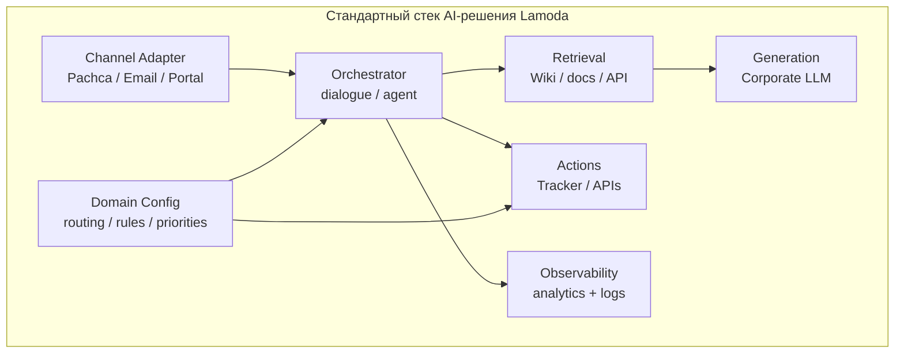

# Стандартизация AI-решений

Документ для обсуждения: как Support AI задаёт **единый подход** к разработке и внедрению AI в Lamoda.

---

## Проблема

Сейчас появляется много AI-решений, которые:

- решают **похожие задачи** разными способами;
- по-разному работают с **LLM, knowledge base, каналами**;
- сложно сравнивать **качество и ROI**;
- нет общего **runbook** эксплуатации.

**Задача:** стандартизировать подход — не «один продукт на всё», а **общие рельсы**, на которых строятся доменные решения (Support, HR, Finance, …).

---

## Reference architecture (на примере Support AI)



Support AI — **первая полная реализация** этого шаблона для домена IT Service Desk.

---

## Слои стандарта

| Слой | Что стандартизируем | Support AI |
|------|---------------------|------------|
| **Channel** | Единый adapter pattern, webhook contract | Pachca webhook + poller |
| **Orchestration** | Когда LLM, когда rules | `dialogue_service` |
| **Retrieval** | Search → rank → filter → top-K | `wiki_service` + priorities |
| **Generation** | Grounded prompts, temperature, limits | `llm/chat.py` |
| **Actions** | Side effects через services, не в LLM | `ticket_service` |
| **Domain** | Config as code, не hardcode в prompts | `knowledge/` |
| **Observability** | Events + dashboard + logs | `/analytics/summary` |
| **Feedback** | 👍/👎 → improve ranking | v0.7 |

---

## Принципы (proposal для всех AI-проектов)

### 1. LLM — не источник истины

- Ответ только на основе retrieval (Wiki, docs, API)
- Явные правила в prompt: «не выдумывать»

### 2. Rules before LLM

- Уточнения, routing, validation — rule-based где возможно
- Меньше cost, больше предсказуемости

### 3. Domain config отдельно от кода

- Keywords, priorities, matrices — в `knowledge/` или аналоге
- Калибровка в production без переписывания orchestrator

### 4. Explicit actions

- Тикеты, API-вызовы — через typed services
- LLM не вызывает external systems напрямую (в v0.6)

### 5. Observability by default

- События: started, answered, feedback, action, error
- Dashboard для ops и product
- Logs snapshot для отладки

### 6. Human in the loop

- Feedback buttons
- Escalation path (тикет)
- Автор действия = реальный пользователь

### 7. Incremental layers

```text
LLM → Retrieval → Channel → Feedback → Actions → Domain rules → Learning
```

Не прыгать сразу к «autonomous agent».

---

## Что можно переиспользовать между проектами

| Компонент | Переиспользование |
|-----------|-------------------|
| LLM client | `app/llm/` — один endpoint для всех |
| Analytics pattern | SQLite events + dashboard template |
| Log buffer | `log_buffer.py` для любого FastAPI-сервиса |
| Channel adapter | Interface: `on_message`, `send_reply`, `buttons` |
| Ranking pipeline | Wiki search → score → priorities → feedback |
| Config layout | `knowledge/{domain}_routing.py` |

---

## Чего избегать (anti-patterns)

| Anti-pattern | Почему |
|--------------|--------|
| «ChatGPT wrapper» без retrieval | Галлюцинации, нет compliance |
| Agent с 20 tools с day one | Непредсказуемость, сложный debug |
| Vector DB «на будущее» без метрик | Over-engineering |
| Routing через LLM | Нестабильно для ITSM |
| Нет analytics | Невозможно улучшать |
| Один monolith prompt | Не масштабируется на домены |

---

## Вопросы для sync-встречи

1. **Единый LLM gateway** — один endpoint / quota / audit для всех проектов?
2. **Единый knowledge layer** — Wiki vs Confluence vs custom — один retrieval API?
3. **Единый channel** — только Pachca или abstraction для всех ботов?
4. **Shared analytics** — общая схема events (interaction_id, feedback, action)?
5. **Governance** — кто владелец domain config (SD vs HR)?
6. **Template repo** — fork Support AI как starter kit?

---

## Support AI как pilot

| Критерий | Статус |
|----------|--------|
| End-to-end flow | ✅ Pachca → Wiki → LLM → Tracker |
| Domain routing | ✅ 150 systems SD |
| Feedback | ✅ 👍/👎 |
| Analytics | ✅ Dashboard |
| Learning loop | ⏳ v0.7 |
| Production SLA | 🎯 v1.0 |

Support AI можно использовать как **reference implementation** при обсуждении стандарта.

---

## Связанные документы

- [architecture.md](architecture.md)
- [components.md](components.md)
- [roadmap.md](roadmap.md)
